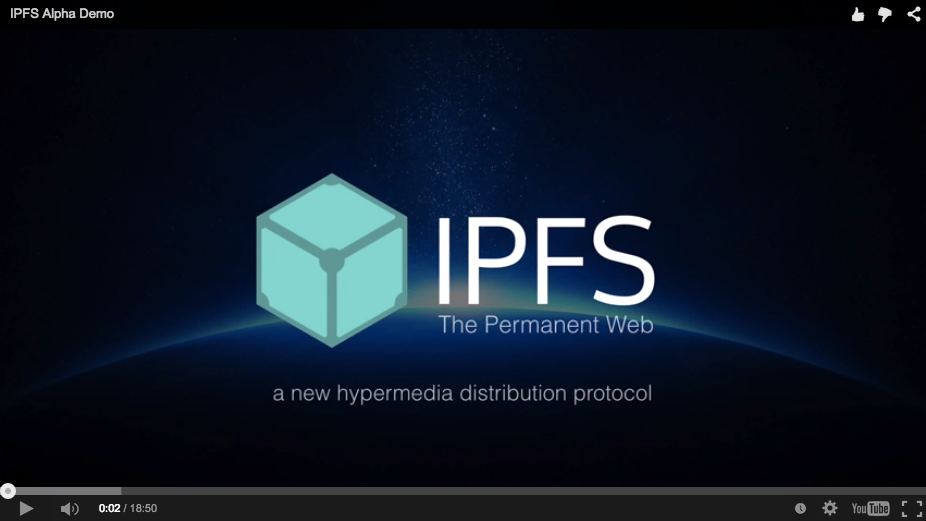
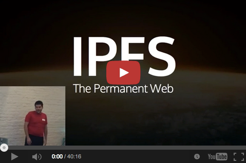

# IPFS - The Permanent Web

IPFS is a distributed file system that seeks to connect all computing devices with the same system of files. In some ways, this is similar to the original aims of the Web, but IPFS is actually more similar to a single bittorrent swarm exchanging git objects.

IPFS could become a new major subsystem of the internet. If built right, it could complement or replace HTTP. It could complement or replace even more. It sounds crazy. It _is_ crazy.

#### IPFS IS A WORK IN PROGRESS

Please note that IPFS is a work in progress. It is an ambitious plan to make the internet more free, open, secure, and high performance. It builds on the good ideas of numerous battle-tested distributed systems.

## [Project directory](project-directory.md)
Lost? Searching for something? Need to submit an issue? Want to contribute? Take a peak at [project-directory.md](project-directory.md) which maps out all the repositories for the ipfs project on Github.

## IPFS Talks

## Design

Please Read:

- [IPFS - Content Addressed, Versioned, P2P File System](https://github.com/ipfs/ipfs/blob/master/papers/ipfs-cap2pfs/ipfs-p2p-file-system.pdf?raw=true)
- IPFS - Toward The Permanent Web

## Implementations

- [github.com/ipfs/go-ipfs](https://github.com/ipfs/go-ipfs) in Go. Status: Alpha (reference)

- [node-ipfs](http://github.com/jbenet/node-ipfs) in js (on hold)

If you would like to start one, please post an issue in this repository so I can help you. There is at present no "perfect spec" and many protocol details are still to be decided upon.

## Summary

IPFS is a protocol:
- defines a content-addressed file system
- coordinates content delivery
- combines Kademlia + BitTorrent + Git

IPFS is a filesystem:
- has directories and files
- mountable filesystem (via FUSE)

IPFS is a web:
- can be used to view documents like the web
- files accessible via HTTP at `http://ipfs.io/<path>`
- browsers or extensions can learn to use `ipfs://` directly
- hash-addressed content guarantees authenticity

IPFS is modular:
- connection layer over any network protocol
- routing layer
- uses a routing layer DHT (kademlia/coral)
- uses a path-based naming service
- uses bittorrent-inspired block exchange

IPFS uses crypto:
- cryptographic-hash content addressing
- block-level deduplication
- file integrity + versioning
- filesystem-level encryption + signing support

IPFS is p2p:
- worldwide peer-to-peer file transfers
- completely decentralized architecture
- **no** central point of failure

IPFS is a cdn:
- add a file to the filesystem locally, and it's now available to the world
- caching-friendly (content-hash naming)
- bittorrent-based bandwidth distribution

IPFS has a name service:
- IPNS, an SFS inspired name system
- global namespace based on PKI
- serves to build trust chains
- compatible with other NSes
- can map DNS, .onion, .bit, etc to IPNS

## FAQ

Feel free to submit more questions as issues or via my email.

#### What is the goal of IPFS?

To evolve infrastructure of the internet and the web, with many things we've learned from successful systems, like [Git](http://git-scm.com/), [BitTorrent](http://bittorrent.org/), [Kademlia](http://en.wikipedia.org/wiki/Kademlia), [Bitcoin](http://bitcoin.org), and many more.

This is the sort of thing that would have come out of ARPA/DARPA/IETF/BellLabs in another age. In this age, these things "come out of the woodwork", which is coming to mean "from the internet", despite wood being a subpar computer construction material.

#### Is this open-source?

Yes! 100% raw, unadulterated, Free Open Source Software.

#### How do i help!?

Please read [CONTRIBUTE.md](CONTRIBUTE.md). Help with the design. Write or contribute to an implementation or application.

#### How is this different from X?

There is probably a specific discussion about that in the issues. If not, start it.

#### Who designed it?

IPFS is the brainchild of [Juan Benet](http://juan.benet.ai).

But IPFS has been designed by the internet at large. The ideas behind IPFS have been around for many years, in the form of excellent open source systems and research. If it gets far at all, IPFS will be standing on the wigs of giants.

And, there are [many people](contributors.md) whose papers, conversations, or work have directly contributed to its design and implementation.

#### What is the relation to [Filecoin](http://filecoin.io)?

Filecoin is the sister protocol of IPFS. While neither protocol depends on each other, they are perfectly complementary. IPFS handles high performance distribution of objects; Filecoin handles incentivizing the world to backup/seed objects.

#### Why the name IPFS?

The original name was GFS, which stood for the Global File System and seemed more accurate than GitFS. But that exact name was already [taken](http://en.wikipedia.org/wiki/GFS2). So I switched Global for Galactic, in an homage to Licklider's [Intergalactic Computer Network](http://en.wikipedia.org/wiki/Intergalactic_Computer_Network), and because peer-to-peer systems look like galaxies to me. But GFS caused confusion with yet another [GFS](http://en.wikipedia.org/wiki/Google_File_System), even though that one is not even open source.

By popular demand (there were votes and a pronouncement of "GFS is dead. Long live IPFS!" and everything), I switched it to IPFS - InterPlanetary File System, which has several nice properties:

- IP evokes the goal better: internet infrastructure
- InterPlanetary still pays a weaker homage to Licklider
- [If all](http://github.com/ipfs/ipfs/issues) [goes well](http://spacex.com), it may some day actually be InterPlanetary.
- Name clashes less.

Though it gets harder every day, I can still be convinced to change the name.
If you have _the_ killer name, drop me a line.
